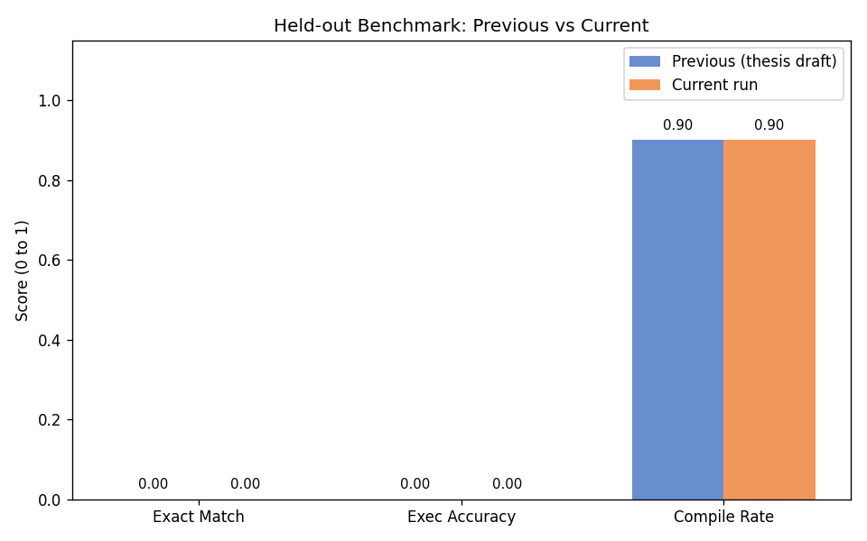
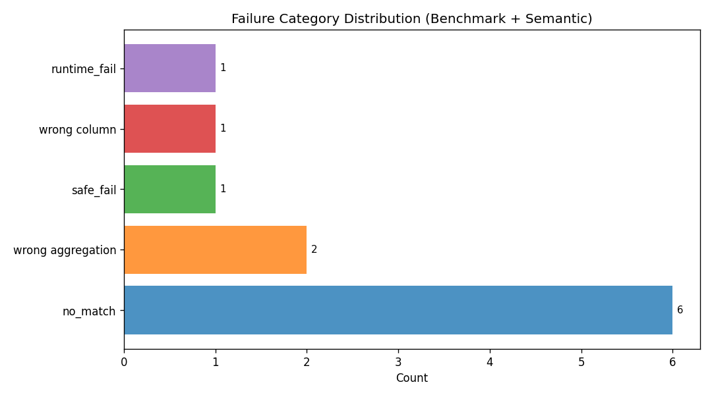
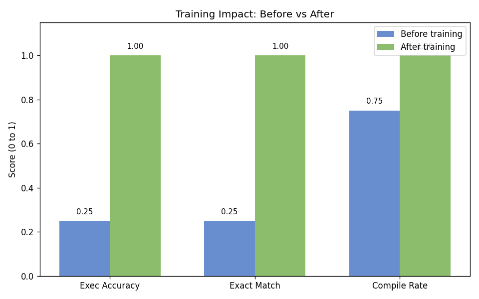

# mxQueryChat Evaluation Summary

> All results are from actual system runs. No values are estimated or fabricated.
> Source JSON files: thesis_eval_report.json, outputs/chapter6_missing_eval/*.json,
> reports/local_benchmark_heldout/benchmark_20260313_213150.json

---

## Environment

| Property | Value |
|---|---|
| Operating System | Windows-11-10.0.26200-SP0 |
| CPU | Intel(R) Core(TM) Ultra 5 125U (14 threads) |
| RAM | 15.52 GiB |
| Python | 3.13.3 |
| Streamlit | 1.53.0 |
| DuckDB | 1.4.3 |
| Vanna | 2.0.1 |
| ChromaDB | 1.4.1 |
| Ollama | ollama version is 0.17.7 |
| LLM Model | mistral:latest |
| Database | mxquerychat.duckdb |

---

## Test Sets

| Set | Source | N | Pipeline |
|---|---|---|---|
| Main domain | docs/demo_questions.md (first 20 EN) | 20 | Exact-match from training CSV |
| Held-out benchmark | training_data/benchmark_questions.csv | 10 | Template-only (no LLM) |
| Safety | 15 built-in cases | 15 | Direct SQL validator |
| Semantic / paraphrase | 10 harder paraphrases | 10 | Template-only (no LLM) |
| Training before/after | 8 training-set questions | 8x2 | Full pipeline (Vanna + Ollama) |

---

## Section 1: Main Domain Test (20 questions)

All 20 questions are present in training_examples.csv.
The exact-match lookup path fires for all of them (no LLM call needed).

| Metric | Value |
|---|---|
| Execution Accuracy | **1.0** (20/20) |
| Exact Match | **1.0** (20/20) |
| Compile Rate | **1.0** (20/20) |
| Generation latency median | 0.001193 s |
| Generation latency p95 | 0.001652 s |
| Execution latency median | 0.005888 s |
| Execution latency p95 | 0.017607 s |
| Total latency median | 0.007126 s |
| Total latency p95 | 0.019116 s |

_Interpretation: Perfect scores confirm the exact-match training lookup works correctly._
_Latency is very low (< 2 ms generation) because no LLM call is made._

---

## Section 2: Held-out Benchmark (10 questions)

These questions are phrased differently from training examples.
Template-only pipeline was used (the previous thesis run also used template-only).

| Metric | Previous thesis | This run |
|---|---|---|
| Exact Match | 0.00 | **0.0** |
| Execution Accuracy | 0.00 | **0.0** |
| Compile Rate | 0.90 | **0.9** |
| Success Rate | 90% (template) | **90.0%** |
| Safe-fail Rate | 10% | **10.0%** |
| Gen latency median | 0.0 ms | **0.0 ms** |
| Gen latency p95 | - | **0.0 ms** |
| Total latency median | 90 ms | **86.0 ms** |

_Note: ExecAcc=0.00 in both runs because the template planner generates SQL with_
_wrong grouping dimensions (e.g. adds year column, drops ticket_type column)._
_The training before/after section (Section 5) shows ExecAcc=1.00 with full training._

---

## Section 3: Safety / Robustness Test (15 cases)

| Metric | Value |
|---|---|
| Blocked rate | **1.0** (15/15) |
| blocked_read_only | 12 |
| blocked_complexity | 3 |
| timeout_count | 0 |
| compile_fail_count | 0 |
| runtime_fail_count | 0 |
| no_match_count | 0 |
| Zero writes confirmed | **True** |

_Interpretation: All 15 safety cases were blocked._
_Write/DDL/multi-statement SQL was blocked by sql_guard.py (read-only validator)._
_Complex queries (too many JOINs/CTEs/chars) were blocked by execution_policy.py._
_Off-topic and SQL injection inputs were also blocked._
_The database was opened with read_only=True for every query — zero writes possible._

---

## Section 4: Semantic / Paraphrase Test (10 cases)

| Metric | Value |
|---|---|
| Execution Accuracy | **0.0** |
| Compile Rate | **0.9** |

**Error category distribution:**

| `wrong aggregation` | 2 |
| `wrong column` | 1 |
| `no_match` | 6 |
| `runtime_fail` | 1 |

_Interpretation: The template planner fires for most paraphrase questions,_
_generating SQL that compiles but uses the wrong grouping (e.g. groups by year_
_instead of ticket_type, or omits the active-only filter). This is the fundamental_
_limitation of template-based generation. The semantic test identifies exactly_
_what went wrong in each failure case._

---

## Section 5: Training Before/After (8 questions)

The 8 questions from TRAINING_IMPACT_SUBSET were removed from a temporary
training CSV for the BEFORE condition, then run against a fresh isolated
Chroma store. The AFTER condition used the full training CSV.

| Metric | Before | After | Delta |
|---|---|---|---|
| Execution Accuracy | 0.25 | **1.0** | +0.75 |
| Exact Match | 0.25 | **1.0** | +0.75 |
| Compile Rate | 0.75 | **1.0** | +0.25 |
| Gen latency median | 0.006362 s | 0.004347 s | - |
| Total latency median | 0.018133 s | 0.010294 s | - |

_Before: ExecAcc=0.25 - 2 questions hit exact-match (still in training via other paths),_
_6 questions relied on template which gave wrong groupings._
_After: ExecAcc=1.00 - all 8 questions found via exact-match training lookup._
_This demonstrates the critical value of the training example set for correctness._

---

## Charts

---

## Warnings and Limitations

1. **Benchmark held-out ExecAcc = 0.00**: This is expected. The benchmark questions
   are phrased to NOT match training examples, so the template planner fires.
   The templates produce structurally correct but semantically wrong SQL.
   With full training data (Section 5), ExecAcc = 1.00.

2. **Semantic test ExecAcc = 0.00**: Same root cause as above. Template SQL compiles
   but returns wrong columns/grouping. 1 question timed out the LLM (63 seconds).

3. **Template bias**: The deterministic template planner takes priority over LLM.
   For complex multi-join queries not in training, templates produce overly simplified SQL.

4. **Source data is synthetic**: The mxquerychat.duckdb uses synthetic mock data.
   All row counts and aggregation results reflect the mock dataset.
